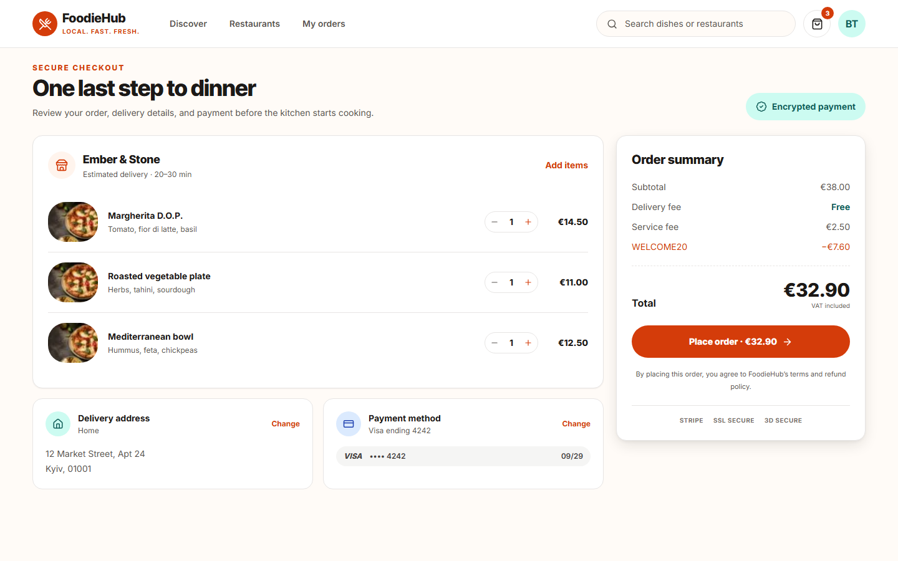
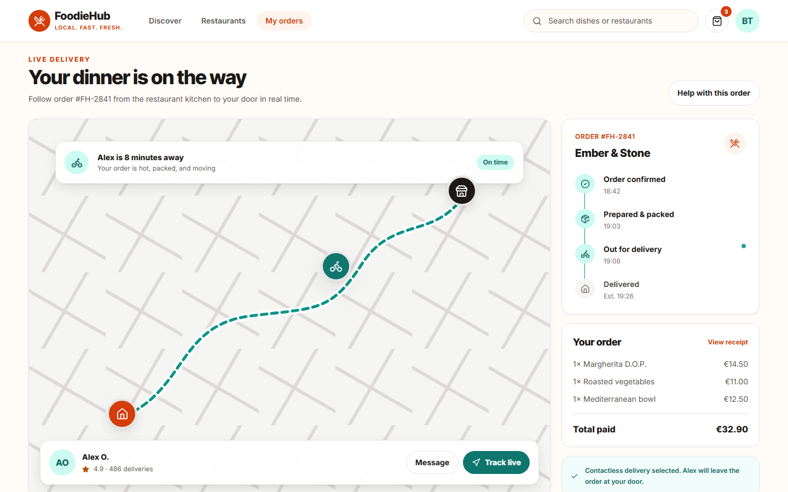

# 🍔 FoodieHub — Food Delivery Service

FoodieHub is a production-style food delivery platform that connects customers, restaurants, and couriers in one real-time ordering experience. It combines restaurant discovery, cart and checkout, Stripe payments, live courier tracking, order management, saved addresses, ratings, and role-based operations.

## Product Experience

| Restaurant discovery | Secure checkout |
| --- | --- |
|  |  |



---

## 🚀 Live Demo
There`s cold start for 3 minutes because of using free render server.  
[👉 View Live Demo](https://foodie-hub-9n96.vercel.app/)

---

## 🛠️ Tech Stack

- **Frontend:** Next.js, React, Tailwind CSS
- **Backend:** Express.js, MongoDB, JWT Auth, Stripe
- **Testing:** Jest, Playwright, Supertest

---

## 📦 Features

- User authentication (signup, login, logout)
- Browse meals & add to cart
- Place and pay for orders (Stripe)
- View order history
- Profile management
- Admin role support

---

## 📌 API Documentation

Backend API is available under `/api`.  
Example endpoints:
- `POST /api/auth/login` — User login  
- `GET /api/order/orders` — Fetch user orders  
- `POST /api/order/orders` — Create a new order  
- `POST /api/payment/payment-intent` — Initiate Stripe payment  

---

## 🧪 Tests

- **Unit & Integration:** covered with **Jest**
- **End-to-End (E2E):** main user flows covered with **Playwright**
  - User login
  - Adding meals to cart
  - Placing and paying for an order

Run tests:
```bash
Frontend
npm run test           # unit & integration tests (Jest)
npx playwright test    # e2e tests (Playwright)

Backend
npm run test           # unit & integration tests (Jest & Supertest)
```

---

## 🚀 Getting Started

### 1. Clone & Install

```bash
git clone https://github.com/yourusername/FoodieHub.git
cd FoodieHub
cd client && npm install
cd ../server && npm install
```

### 2. Environment Variables

- Copy `.env.example` to `.env` in both `client/` and `server/`
- Fill in your MongoDB URI, Stripe keys, JWT secret, etc.

### 3. Run Development Servers

**Frontend:**
```bash
cd client
npm run dev
```
Open [http://localhost:3000](http://localhost:3000)

**Backend:**
```bash
cd server
npm run dev
```

---

## 📄 License

This project is licensed under the [GNU GPL v3](LICENSE).

---

## 💡 Credits

Made with ❤️ by [gaykun1](https://github.com/gaykun1)
