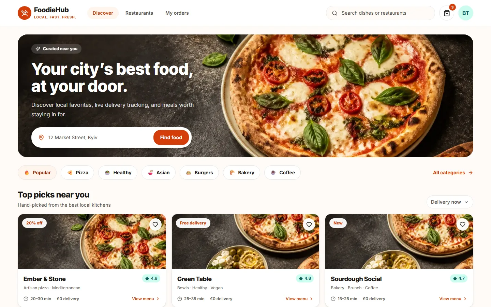
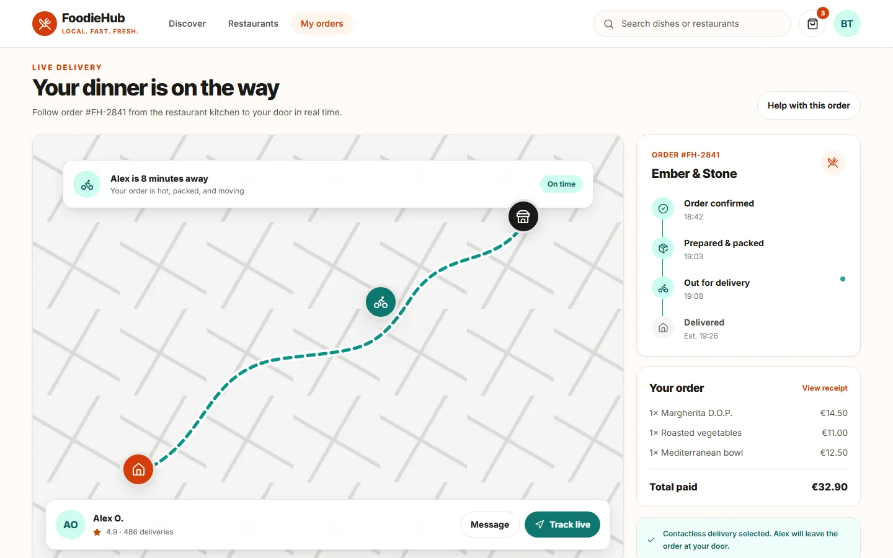
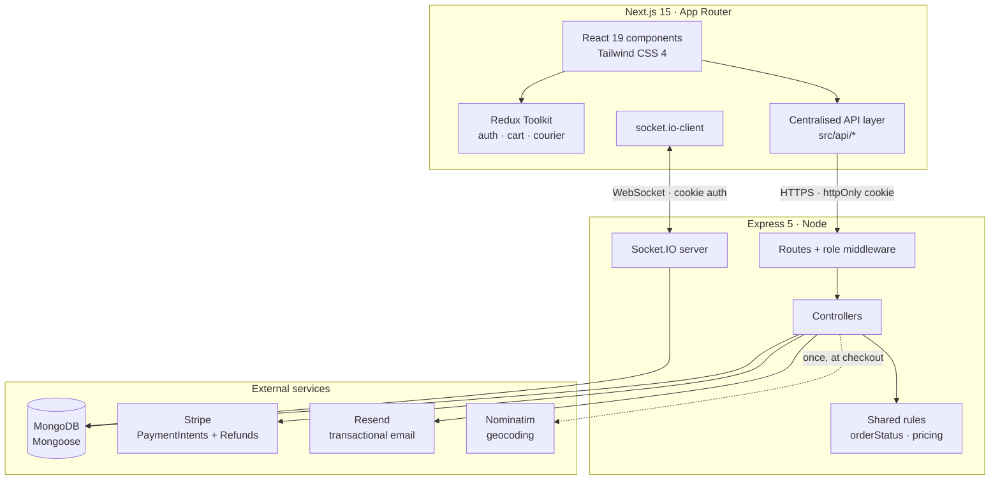
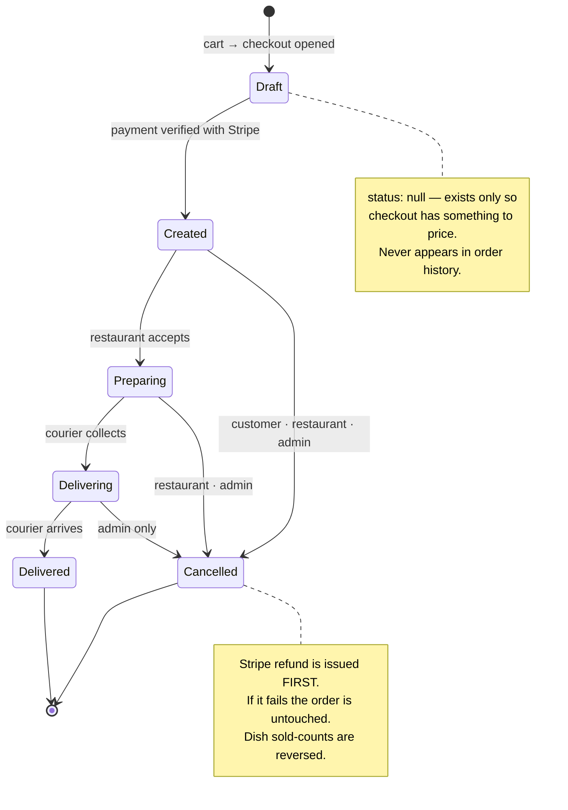
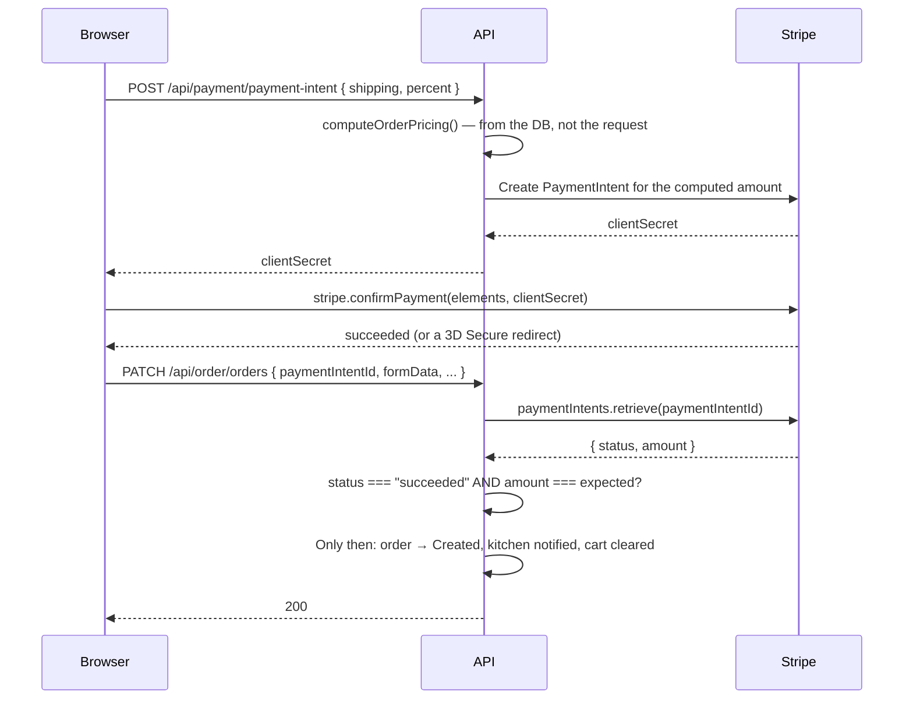

<div align="center">

# 🍔 FoodieHub

**A production-style food delivery marketplace — customers, restaurants, couriers and admins in one real-time system.**

[](https://github.com/3cgbdg/Foodie-Hub/actions/workflows/ci.yml)
[](LICENSE)


[**Live demo**](https://foodie-hub-9n96.vercel.app/) · [Demo credentials](#-try-it-in-two-minutes) · [Architecture](#-architecture) · [Testing](#-testing--security)

</div>

---

## Product experience

| Restaurant discovery | Secure checkout |
| --- | --- |
|  |  |



---

## 🚀 Try it in two minutes

**[👉 Open the live demo](https://foodie-hub-9n96.vercel.app/)**

> The API runs on a free Render instance, so the first request after a period of
> inactivity can take up to ~60 seconds to wake the server. Everything is
> instant after that.

**You do not need an account to look around.** Browsing restaurants, reading
menus and reviews, and filling a basket are all open to anonymous visitors —
signing in is only required at checkout.

When you do want to sign in, the login screen offers one-click demo accounts:

| Role | Username | Password | What it shows |
| --- | --- | --- | --- |
| Customer | `demo` | `DemoPass123` | Browse → cart → checkout → live tracking → rating |
| Restaurant | `demo-restaurant` | `DemoPass123` | Incoming orders, menu management, revenue dashboard |
| Courier | `demo-courier` | `DemoPass123` | Claim deliveries, push live GPS updates |
| Admin | `demo-admin` | `DemoPass123` | Platform statistics, courier applications |

**Stripe test card** — payments run in Stripe test mode, so nothing is ever
charged:

```
4242 4242 4242 4242   ·   any future expiry   ·   any CVC   ·   any postcode
```

The checkout screen shows this card with a copy button when the deployment runs
in demo mode, so there is nothing to memorise.

### Seeing a delivery actually happen

A portfolio demo has nobody staffing the kitchen dashboard, so a real order
would sit at *Order placed* forever. After checking out, the tracking screen
offers **Simulate this delivery**: the server then walks the order through its
genuine lifecycle — `Created → Preparing → Delivering → Delivered` — and
animates the courier along the stored route, emitting exactly the same Socket.IO
events a real courier's phone would. It writes real state through the real
models; only the human is simulated.

---

## 🧭 What this project demonstrates

This is a marketplace, not a restaurant UI. Four roles share one system, and the
interesting parts are where they meet:

- **Money is never trusted from the client.** Order totals, shipping and
  discounts are recomputed server-side from persisted data, and the order is
  only finalised after the server independently re-checks with Stripe that the
  PaymentIntent succeeded *for that exact amount*.
- **A single order lifecycle**, defined once and shared. Legal transitions,
  per-role cancellation windows and revenue classification all derive from one
  table, so no endpoint can invent its own rules.
- **Real-time by role.** Customers watch their own order; restaurants watch
  their own queue; admins watch the platform. Room membership is authorised from
  the auth cookie, not from a client-supplied id.
- **Refunds are atomic.** A cancellation issues a real Stripe refund first; if
  that fails, the order is left completely untouched rather than landing in a
  "cancelled but not refunded" state.

---

## 🏗 Architecture



### Repository layout

```
client/                 Next.js app
  src/api/              One module per resource — every request goes through here
  src/lib/apiClient.ts  Single axios instance (baseURL + credentials + errors)
  src/lib/orderStatus.ts  Client mirror of the server's lifecycle table
  src/components/       UI, grouped by feature
  tests/e2e/            Playwright journey

server/                 Express API
  controllers/          Request handling
  middleware/           authMiddleware + requireRole(...)
  models/               Mongoose schemas
  services/             deliverySimulator (demo mode)
  utils/orderStatus.ts  The order lifecycle — single source of truth
  utils/pricing.ts      Server-side total/shipping/discount computation
  scripts/seed.ts       Deterministic demo dataset
  tests/                Jest + Supertest
```

---

## 👥 Roles

| Role | Can do |
| --- | --- |
| **Guest** | Browse restaurants, menus, reviews and trending dishes; fill a basket (kept in `localStorage` and merged into the account on sign-in) |
| **Customer** | Everything a guest can, plus place and pay for orders, track deliveries live, cancel before preparation starts, save addresses, favourite restaurants, redeem promocodes, rate completed orders |
| **Restaurant** | Accept incoming orders, manage the menu and about page, cancel orders it cannot fulfil, view its own revenue and review dashboard |
| **Courier** | See unclaimed orders in their city, claim one, publish live GPS position, advance the order through delivery |
| **Admin** | Platform-wide statistics, recent orders and reviews, approve or decline courier applications, cancel any in-flight order |

Roles are resolved from the **stored user record** on every request, not from
the JWT's claim — so a role change takes effect immediately rather than at the
next token expiry.

---

## 🔄 Order lifecycle



Every transition above is enforced by
[`server/utils/orderStatus.ts`](server/utils/orderStatus.ts). The courier
endpoint validates both the status value *and* the transition, so an order can
never skip a step or move backwards.

Who may cancel, and how late:

| Actor | Created | Preparing | Delivering | Delivered |
| --- | :---: | :---: | :---: | :---: |
| Customer | ✅ | — | — | — |
| Restaurant | ✅ | ✅ | — | — |
| Admin | ✅ | ✅ | ✅ | — |

---

## 📡 Real-time tracking (Socket.IO)

```mermaid
sequenceDiagram
    participant C as Customer
    participant S as Socket.IO server
    participant K as Courier device

    Note over C,K: Handshake carries the same httpOnly auth cookie<br/>the REST API uses; unauthenticated sockets are rejected.

    C->>S: joinOrder { orderId }
    S->>S: Is this the order's customer or its courier?
    S-->>C: joined room <orderId>

    K->>S: joinOrder { orderId }
    S-->>K: joined room <orderId>

    loop every 5s while delivering
        K->>S: updateLocation { orderId, lat, lng }
        S->>S: Verify sender is the ASSIGNED courier
        S-->>C: locationUpdate { lat, lng }
    end

    K->>S: PATCH status → Delivered
    S-->>C: updateOrderStatus { status, id }
    S-->>S: fan out to restaurant + admin dashboards
```

**Why room membership is checked server-side.** The room name is the order id.
Without authorisation, anyone who knew or guessed an id could join a stranger's
tracking room and watch their courier's live GPS — or push fake positions into
it. Both the join and the position publish are verified against the
authenticated user.

**Rooms:**

| Room | Who may join | Events |
| --- | --- | --- |
| `<orderId>` | The order's customer or its assigned courier | `locationUpdate` |
| `<adminUserId>` | Admins only | `updateOrders`, `updateReviews` |
| `<restaurantId>` | The account that owns that restaurant | `incomingOrders`, `updateRestaurantOrders` |

**Route coordinates are stored on the order.** Tracking used to geocode both the
restaurant and the delivery address through Nominatim *every time the map
opened* — two third-party round-trips per view, rate-limited, and capable of
silently relocating a delivered order. Checkout now resolves both points once
and persists them as `Order.route`.

---

## 💳 Payments



Three deliberate properties:

1. **The client never names a price.** The charge amount is computed from the
   order's own persisted line items, a whitelisted shipping tier, and a discount
   clamped to the promocodes the user actually holds.
2. **The order is finalised after payment, not before.** A declined card, a
   closed tab or an abandoned 3D Secure challenge leaves no unpaid order in the
   kitchen queue.
3. **Confirmation is re-verified server-side.** The client only *triggers*
   finalisation; the server asks Stripe directly whether that PaymentIntent
   succeeded and for how much.

Checkout state is persisted to `sessionStorage` before confirmation, so an order
still finalises correctly when Stripe redirects the browser away for a 3D Secure
challenge.

### Webhooks

The current flow is **pull-based**: the server retrieves and verifies the
PaymentIntent at the moment of finalisation rather than waiting to be told. This
is deliberate for a demo — it needs no publicly reachable webhook endpoint, so
the app works identically on `localhost` and on a free Render instance.

A production deployment would add `POST /api/payment/webhook` with
`stripe.webhooks.constructEvent` signature verification, handling
`payment_intent.succeeded` (finalise orders whose browser never came back) and
`charge.refunded` (reconcile refunds issued from the Stripe dashboard). The
verification logic itself already exists and is shared; only the transport would
change.

---

## 🧪 Testing & security

```
server:  308 tests across 23 suites   (Jest + Supertest + mongodb-memory-server)
client:   21 tests across  3 suites   (Jest + Testing Library)
e2e:       3 specs                    (Playwright)
```

Run everything:

```bash
npm test
```

What the suites actually pin down:

| Area | Where |
| --- | --- |
| Checkout totals, shipping tiers, promo clamping, rounding | `server/tests/integration/pricing.test.ts` |
| Order state machine — transitions, terminal states, cancellation windows | `server/tests/unit/orderStatus.test.ts` |
| Cancellation and refund rules per role, refund-before-write ordering | `server/tests/integration/orderCancellation.test.ts` |
| Live courier positions, simulator lifecycle, room scoping | `server/tests/integration/deliverySimulation.test.ts`, `socket.test.ts` |
| Authorisation matrix — wrong role *and* right role/wrong resource | `server/tests/integration/authorization.test.ts` |
| Guest browsing — public catalogue open, account actions closed | `server/tests/integration/guestBrowsing.test.ts` |
| Discovery → cart → checkout → tracking | `client/tests/e2e/journey.spec.ts` |

The end-to-end journey stubs the API at the network layer, so it needs no
database, no Stripe key and no seeded data — it runs on every push and catches
the front-end flow breaking, which is what actually regresses.

### CI

Every push and pull request runs [`.github/workflows/ci.yml`](.github/workflows/ci.yml):

| Job | Steps |
| --- | --- |
| **Secret scan** | Gitleaks over the full history |
| **Server** | typecheck → 308 tests → build |
| **Client** | lint → typecheck → 21 tests → production build |
| **E2E** | Playwright journey against a production build |

### Security measures

- **httpOnly, `SameSite=None; Secure` cookies** — the JWT is never readable from JavaScript.
- **Roles resolved from the database**, not the token claim, so a demoted account loses access immediately.
- **Rate limiting** on `/api/auth/login` and `/api/auth/signup` (20 attempts per IP per 15 minutes).
- **Helmet** security headers; **CORS** restricted to a single configured origin.
- **bcrypt** password hashing with a server-side strength policy that a direct API call cannot bypass.
- **Regex injection guarded** — user-supplied search text is escaped before being used as a `$regex`, closing a ReDoS vector.
- **Socket handshake authentication** with per-room ownership checks.
- **Ownership checks everywhere an id appears in a URL** — every "which resource" decision is resolved from the authenticated user.

---

## 🛠 Tech stack

**Frontend** — Next.js 15 (App Router) · React 19 · TypeScript · Tailwind CSS 4 · Redux Toolkit · React Hook Form · Leaflet · Motion · Stripe Elements

**Backend** — Node · Express 5 · TypeScript · MongoDB + Mongoose · Socket.IO · JWT · bcrypt · Stripe · Resend · node-cron

**Tooling** — Jest · Supertest · mongodb-memory-server · Testing Library · Playwright · ESLint · GitHub Actions

---

## ⚡ Local setup

**Prerequisites:** Node 20+, and MongoDB running locally (or an Atlas connection string).

```bash
git clone https://github.com/3cgbdg/Foodie-Hub.git
cd Foodie-Hub
npm run install:all
cp .env.example server/.env      # fill in MONGO_URI, JWT_SECRET, STRIPE_SECRET_KEY
cp .env.example client/.env.local # fill in NEXT_PUBLIC_API_URL, NEXT_PUBLIC_STRIPE_PUBLISHABLE_KEY
npm run seed                      # restaurants, dishes, demo accounts, order history
```

Then start both processes:

```bash
npm run dev:server
```

```bash
npm run dev:client
```

Open [http://localhost:3000](http://localhost:3000) and sign in as `demo` /
`DemoPass123`.

<details>
<summary><b>All available scripts</b></summary>

| Command | What it does |
| --- | --- |
| `npm run install:all` | Install both packages |
| `npm run dev:client` / `npm run dev:server` | Start each dev server |
| `npm run seed` | Reset and repopulate the demo dataset (idempotent) |
| `npm --prefix server run migrate:address` | One-off `adress` → `address` field rename for pre-existing data |
| `npm run lint` | ESLint over the client |
| `npm run typecheck` | `tsc --noEmit` over both packages |
| `npm test` | Client and server test suites |
| `npm run test:e2e` | Playwright journey |
| `npm run build` | Production build of both packages |

</details>

<details>
<summary><b>Upgrading an existing database</b></summary>

The `Order.adress` and `Restaurant.adress` fields were renamed to `address`. A
database populated before that change needs a one-off migration, or those
documents will present an undefined address:

```bash
npm --prefix server run migrate:address -- --dry-run
```

```bash
npm --prefix server run migrate:address
```

It is idempotent, and refuses to run if any document somehow carries both
spellings rather than discarding the newer value.

</details>

<details>
<summary><b>Environment variables</b></summary>

See [`.env.example`](.env.example) — it documents every variable for both
packages, including the two demo-only switches (`DEMO_SIMULATION` on the server
and `NEXT_PUBLIC_DEMO_MODE` on the client), which are off by default so a real
deployment never advertises shared credentials.

</details>

---

## 📌 API overview

All routes are prefixed with `/api`. Authentication is a `token` httpOnly cookie.

| Area | Endpoints |
| --- | --- |
| Auth | `POST /auth/signup` · `POST /auth/login` · `POST /auth/logout` · `GET|PATCH /auth/profile` |
| Restaurants | `GET /restaurant/restaurants/filter` · `/search` · `/:id` · `/:id/reviews` · `/:id/about` |
| Dishes | `GET /restaurant/dishes/:restaurantId` · `GET /restaurant/dishes/nearby` |
| Cart | `GET /cart/` · `POST /cart/items` · `PATCH /cart/items/:id` |
| Orders | `POST|PATCH|GET /order/orders` · `GET /order/orders/:id` · `PATCH /order/orders/:id/cancel` |
| Payments | `POST /payment/payment-intent` |
| Courier | `POST /courier/applications` · `POST /courier/orders/:id/take` · `PATCH /courier/orders/:id/status` |
| Addresses | `GET|POST /address/addresses` · `PATCH|DELETE /address/addresses/:id` |
| Ratings | `GET|POST /rating/orders/:id/rating` |
| Demo | `GET /demo/status` · `POST /demo/orders/:id/simulate` *(404 unless demo mode is on)* |

---

## 📄 License

[GNU GPL v3](LICENSE)

## 💡 Credits

Built by [gaykun1](https://github.com/gaykun1).
